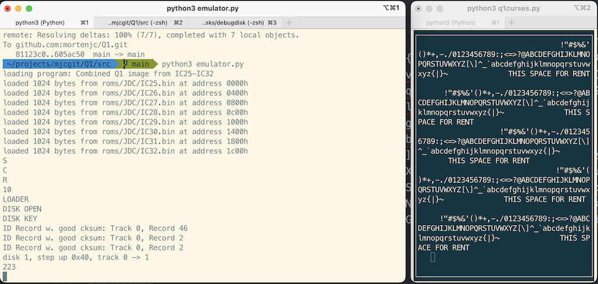

Emulator
========

The **emulator** runs the program and displays the runtime status
of the program counter, registers, decoded instructions, etc.

  Q1 Emulator Architecture

The emulator can be run with disassembly:

.. code-block:: console

  > python3 emulator.py -d
  ; jump to START
  0000 c3 e5 01     ; jp 0x1e5        | SP=0000, A=00    BC=0000, DE=0000, HL=0000
  ; START()
  01e5 ed 56        ; im 0x1          | SP=0000, A=00    BC=0000, DE=0000, HL=0000
  01e7 3e 04        ; ld a, 0x4       | SP=0000, A=00    BC=0000, DE=0000, HL=0000
  01e9 d3 01        ; out (0x1), a    | SP=0000, A=04    BC=0000, DE=0000, HL=0000
  ; 01eb setup registers for copying and clearing
  01eb 11 3f 00     ; ld de, 0x3f     | SP=0000, A=04    BC=0000, DE=0000, HL=0000
  01ee 21 80 40     ; ld hl, 0x4080   | SP=0000, A=04    BC=0000, DE=003f, HL=0000
  01f1 f9           ; ld sp, hl       | SP=0000, A=04    BC=0000, DE=003f, HL=4080
  01f2 eb           ; ex de, hl       | SP=4080, A=04    BC=0000, DE=003f, HL=4080
  ; 01f3 copy (function calls) from 0x003f:0x0047 to 0x4080:
  01f3 01 09 00     ; ld bc, 0x9      | SP=4080, A=04    BC=0000, DE=4080, HL=003f

However, for interactive sessions it is better to skip periodic hexdump and
instruction decode, and use the display emulator:

  Left window: debug output and keyboard input. Right window display emulator.
