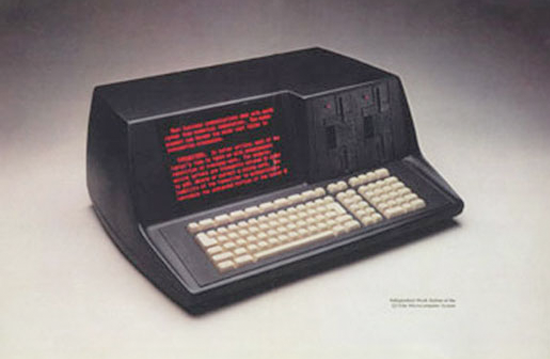

Q1-Lite Emulator
================

Documentation for the efforts of running the Q1-Lite z80 based
software from ROMs.

Quite a lot of progress since the beginning on 2024 07 03: Keyboard input,
display output, disk io. Can load and run programs from (emulated) disk.

  Q1 Lite, generation 3?

Collaborators wanted, please get in touch ;-)

.. note::

    If you consider using this project you should be aware that the code is subject
    to frequent change without notice. Behaviour and output formats are likely to
    be different in newer versions.

    .. toctree::
        :caption: Background
        :maxdepth: 3
        :hidden:

        information

    .. toctree::
        :caption: System
        :maxdepth: 3
        :hidden:

        roms
        q1io
        disk
        q1decode

    .. toctree::
        :caption: Emulator
        :maxdepth: 3
        :hidden:

        hooks
        running
        annotate
        log
